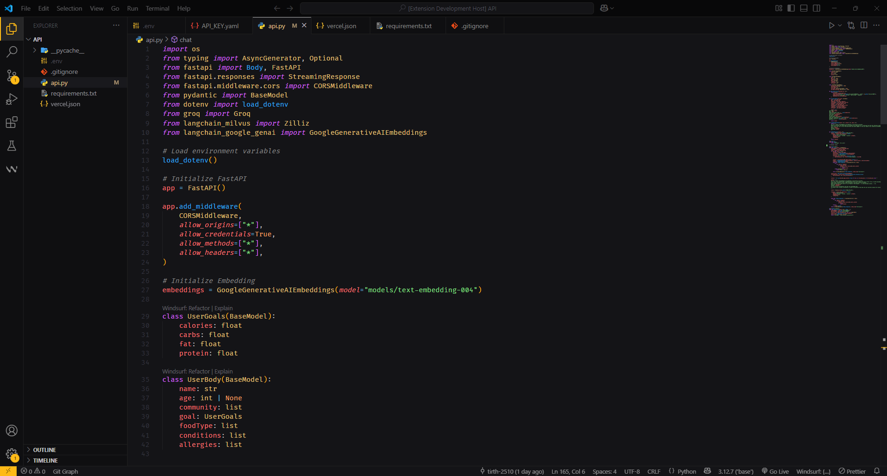

# Coders Theme

A dark theme forged for serious developers — blending the disciplined elegance of One Dark Pro with the vibrant, neon essence of Beard Theme.

---

## Why Coders Theme?

For years, I searched for the perfect developer color scheme — something that was functional, focused, yet had personality. With the energetic glow of **Beard Theme** and my undying love for **One Dark Pro** color combination I present to you **Coders Theme**.

---

## 🚀 Features

-   ✅ Syntax support for all major languages
-   ✅ Fine-tuned semantic token styling
-   ✅ Compatible with both **lightweight** and **complex** editor setups
-   ✅ Works out-of-the-box with extensions like ESLint, GitLens, Prettier, etc.
-   ✅ Actively maintained and open to community feedback

---

---

## 🔧 Installation

1. Open **Extensions** in VS Code (`Ctrl+Shift+X`)
2. Search for `Coders Theme`
3. Click **Install**

**Enjoy**
